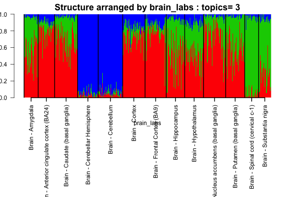

# CountClust
A R package for counts clustering- 

Authors : [Kushal K Dey](kkdey.github.io), [Matthew Stephens](http://stephenslab.uchicago.edu/) 

## Installation

To download and install this package, 

```
install.packages("devtools")
library(devtools)
install_github("kkdey/CountClust")
```

Load the package in R

```
library(CountClust)
```

## Example Use

Load the counts data (samples along the rows, variables or features along the columns) in R. Here we use a test data comprising of the brain samples in GTEX V6 data

```
brain_data <- t(data.frame(data.table::fread("test/cis_gene_expression_brain.txt"))[,-(1:2)]);
brain_data <- brain_data[,1:1000];
dim(brain_data)
```
Next we load the brain metadata 

```
metadata <- cbind.data.frame(read.table("test/metadata_brain.txt")[,3]);
colnames(metadata) <- "brain_labs"
dim(metadata)
```

### Model fit and Visualization

We  apply the StructureObj function to fit the topic model (due to the **maptpx** package of Matt Taddy) 
and plot the Structure plot. 

```
if(!dir.exists("test/Structure")) dir.create("test/Structure")
StructureObj(brain_data, nclus_vec=3, samp_metadata = metadata, tol=0.1, batch_lab = NULL,
             plot=TRUE, path_rda="test/topics_data.rda", path_struct="test/Structure")
```

This function will output two things:

-  a rda file containing all topic model information named "test/topics_data.rda" 
-  The Structure plot for K=3 arranged by the metadata provided in test/Structure. If samp_metadata is a matrix 
   with several columns, then Structure plots arranged by each column in samp_metadata will be created.

The rda file contains the W (the topic proportion matrix) and T (topic distribution) files, so if you need to change
the Structure plot, you do not need to rerun the StructureObj fit again and you can just load the W matrix in rda 
file into out StrutureObj_omega() function.

```
brain_structure <- get(load("test/topics_data.rda"));
StructureObj_omega(brain_structure[[1]]$omega, samp_metadata = brain_metadata, 
                          batch_lab = NULL, path_struct="test/Structure",
                          control=list(cex.axis=1, struct.width=500, struct.height=500))
```

Then go to `test/Structure` and you will be able to see the Structure plot for K=3 with width and the height
of the Structure plot modified.

The Structure plot generated looks like the following




### Cluster annotations

To extract the variables that drive the clusters (cluster annotation)

```
theta <- brain_structure[[1]]$theta;
features <- ExtractTopFeatures(theta,top_features=50,method="poisson")
```
It will provide you with a list of top 50 variables/features per cluster that drive that cluster to be
different from the rest.

## Licenses

The CountClust package is distributed under [GPL - General Public License (>= 2)]

## Contact

For any queries, contact [kkdey@uchicago.edu](kkdey@uchicago.edu)

## Acknowledgements

- Joyce Hsiao
- Raman Shah


