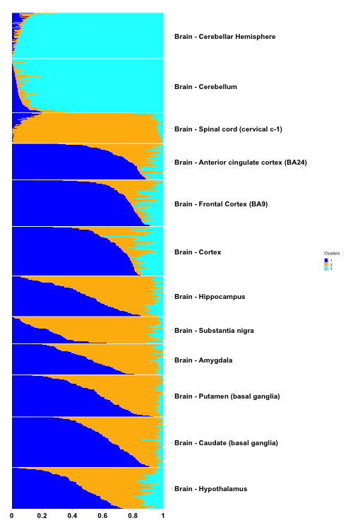

# CountClust
A R package for counts clustering-

[Kushal K Dey](http://kkdey.github.io/), [Chiaowen Joyce Hsiao](http://cbcb.umd.edu/~chsiao/), [Matthew Stephens](http://stephenslab.uchicago.edu/)


## Installation

`CountClust` requires the `limma` package from [Bioconductor]
(https://bioconductor.org/packages/release/bioc/html/limma.html):

```
source("http://bioconductor.org/biocLite.R")
biocLite("limma")
```

To download and install this package,

```
install.packages("devtools")
library(devtools)
install_github("kkdey/CountClust")
```

Load the package in R

```
library(CountClust)
```

## Application of CountClust

Load the counts data (samples along the rows, variables or features along the columns) in R. Here we use a test data comprising of the brain samples in GTEX V6 data

```
brain_data <- t(data.frame(data.table::fread("test/cis_gene_expression_brain.txt"))[,-(1:2)]);
```
Next we load the brain metadata

```
brain_labels <- as.vector((read.table("metadata_brain.txt")[,3]));

```

### Model fit 

We  apply the StructureObj function to fit the topic model (due to the **maptpx** package of Matt Taddy) for clusters 2 and 3. 

```
if(!dir.exists("test/Structure")) dir.create("test/Structure")
StructureObj(brain_data, nclus_vec=2:3, samp_metadata = metadata, tol=0.1, batch_lab = NULL,
             plot=TRUE, path_rda="test/topics_data.rda", path_struct="test/Structure")
```

This function will output a rda file containing a list of size 2 (corresponding to clusters 2 and 3). Each element of the list is a topic model class (as defined by `topics()` function in  `maptpx` package) and contains the W (the topic proportion matrix) and T (topic distribution) files.

### Cluster Visualization

One can plot the W matrix using a Structure plot. Here we provide an example of the Structure plot for K=3 for the above topic model fit. 

```
Topic_clus <- get(load("topics_data.rda"));
omega <- Topic_clus$clust_3$omega;

rownames(omega) <- paste0("X", 1:length(brain_labels))
annotation <- data.frame(
  sample_id = paste0("X", 1:length(brain_labels)),
  tissue_label = factor(brain_labels,
                        levels = rev(unique(brain_labels)) ) )


cols <- c("blue", "darkgoldenrod1", "cyan")


StructureGGplot(omega = omega,
                annotation= annotation,
                palette = cols,
                yaxis_label = "",
                order_sample = TRUE,
                split_line = list(split_lwd = .4,
                                  split_col = "white"),
                axis_tick = list(axis_ticks_length = .1,
                                 axis_ticks_lwd_y = .1,
                                 axis_ticks_lwd_x = .1,
                                 axis_label_size = 10,
                                 axis_label_face = "bold"))

```




### Cluster annotations

We can extract the features that drive the clusters for K=3 as follows 

```
theta <- Topic_clus$clust_3$theta;
features <- ExtractTopFeatures(theta,top_features=50, method="poisson", options="min")
```
It will provide you with a list of top 50 variables/features per cluster that are relatively most highly expressed in that cluster compared to the other clusters, or in other words, plays the most important role in driving or separating out that cluster from the rest. 

## Licenses

The CountClust package is distributed under [GPL - General Public License (>= 2)]

## Contact

For any queries, contact [kkdey@uchicago.edu](kkdey@uchicago.edu)

## Acknowledgements

- Raman Shah


