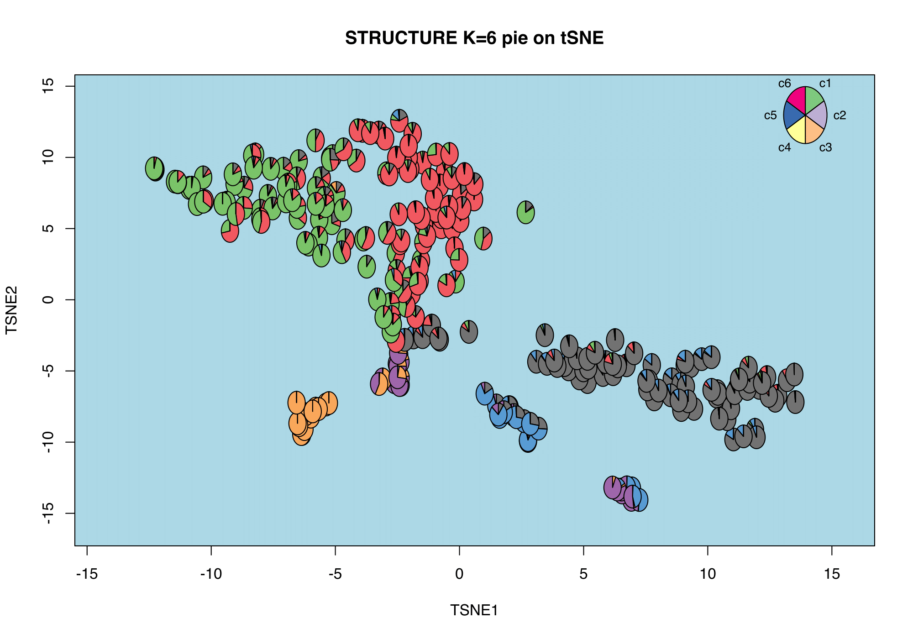
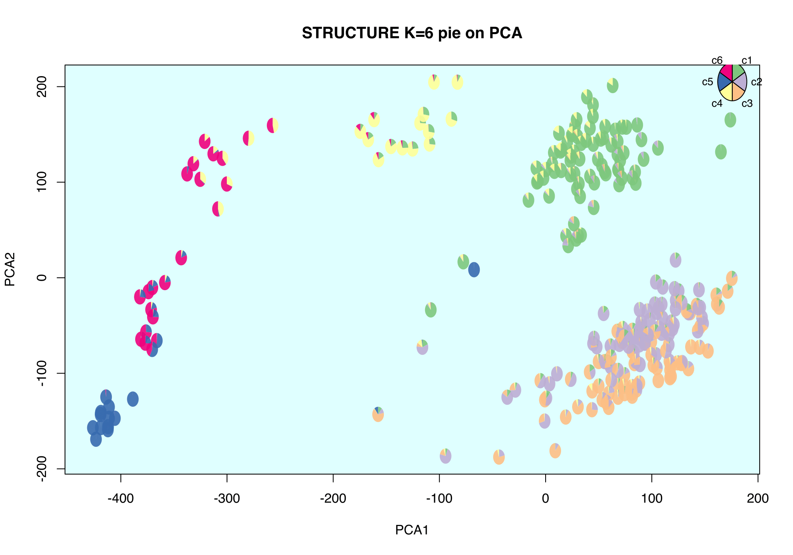

# CountClust

An R package for Grade of Membership (GoM) model fit and visualization
of counts data.

[Kushal K Dey](http://kkdey.github.io), [Chiaowen Joyce Hsiao](http://jhsiao999.github.io/), [Matthew Stephens](http://stephenslab.uchicago.edu/)

**Important update:** We are encouraging CountClust users to use
our new R package, [fastTopics](https://github.com/stephenslab/fastTopics).
This new package has most of CountClust's features, plus several important
improvements, including model fitting algorithms that are faster and
more accurate.

## How to cite

If you are find CountClust useful, please cite:

Dey K, Hsiao C, and Stephens M (2017). Visualizing the structure of
RNA-seq expression data using grade of membership models. *PLoS
Genetics*  **13**: e1006599

Taddy M (2012). On Estimation and Selection for Topic Models. *AISTATS, JMLR* 22.


## Installation

`CountClust` requires the following CRAN-R packages:  `slam`, `ggplot2`, `cowplot`, `parallel` along with the Bioconductor package: `limma`.

One can install `CountClust` from Bioc as follows 

```
source("http://bioconductor.org/biocLite.R")
biocLite("CountClust")
```

For installing the working version of this package from Github please run

```
install_github('kkdey/CountClust')
```

To avoid bug issues for large datasets, we recommend the user to install the latest `maptpx` package from Github.

```
library(devtools)
install_github('TaddyLab/maptpx')
```


To replicate the data example in this README, please install the following data package.

```
install_github('kkdey/singleCellRNASeqMouseDeng2014') 
```

Then load the `CountClust` package in R:

```
library(CountClust)
```

## Preprocessing

We load the single cell RNA-seq data due to [Deng et al 2014](http://www.ncbi.nlm.nih.gov/pubmed/24408435). The data contains RNA-seq read counts for single cells at different stages of mouse embryo development (from zygote to blastocyst). 

```
library(singleCellRNASeqMouseDeng2014)
deng.counts <- exprs(Deng2014MouseESC)
deng.meta_data <- pData(Deng2014MouseESC)
deng.gene_names <- rownames(deng.counts)
```

## CountClust Model

We apply the `FitGoM` function (which is a wrapper of the `topics` function in the maptpx package) for a user specified number of clusters (K=6 for the example below).

```
FitGoM(t(deng.counts),K=3,path_rda="data/MouseDeng2014.FitGoM.rda")
```

This function will output a list - of which the key components are the two matrices `omega` and `theta`. `omega` denotes the matrix of cluster memberships for each sample and `theta` denotes the matrix of proportional contribution of each feature to a cluster. 

## CountClust Visualization


### Structure Bar Plot 

One can plot the `omega` from the `FitGoM` functionusing a Structure Bar plot. Here we provide an example of the Structure plot for K=6 for the above GoM model fit. 

```
data("MouseDeng2014.FitGoM")
names(MouseDeng2014.FitGoM)
omega <- MouseDeng2014.FitGoM$clust_6$omega


annotation <- data.frame(
  sample_id = paste0("X", c(1:NROW(omega))),
  tissue_label = factor(rownames(omega),
                        levels = rev( c("zy", "early2cell",
                                        "mid2cell", "late2cell",
                                        "4cell", "8cell", "16cell",
                                        "earlyblast","midblast",
                                         "lateblast") ) ) )

rownames(omega) <- annotation$sample_id;

StructureGGplot(omega = omega,
                annotation = annotation,
                palette = RColorBrewer::brewer.pal(8, "Accent"),
                yaxis_label = "Amplification batch",
                order_sample = TRUE,
                axis_tick = list(axis_ticks_length = .1,
                                 axis_ticks_lwd_y = .1,
                                 axis_ticks_lwd_x = .1,
                                 axis_label_size = 7,
                                 axis_label_face = "bold"))

```


### STRUCTURE Pie + tSNE/PCA

One can also visualize the STRUCTURE grades of membership colorings aggregated
with the t-SNE or the PCA plots, as follows.

t-SNE + CountClust grades coloring

```
StructurePie(t(deng.counts), input_type="apply_tsne",
             use_voom=FALSE, omega = omega, xlab="TSNE1",
             ylab = "TSNE2",
             main = "STRUCTURE K=6 pie on tSNE",
             control = list(bg = "lightcyan"))
```


PCA + CountClust grades coloring 

```
StructurePie(t(deng.counts), input_type="apply_pca",
             use_voom = TRUE, omega = omega, xlab="PCA1",
             ylab = "PCA2",
             main = "STRUCTURE K=6 pie on PCA",
             control = list(bg = "lightcyan"))
```



## CountClust Cluster Annotations

We can extract the features that drive the clusters for K=6 as follows 

```
theta_mat <- MouseDeng2014.topicFit$clust_6$theta;
top_features <- ExtractTopFeatures(theta_mat, top_features=100,
                                   method="poisson", options="min");
gene_list <- do.call(rbind, lapply(1:dim(top_features)[1],
                        function(x) deng.gene_names[top_features[x,]]))
```
It will provide you with a list of top 100 variables/features per cluster that are relatively most highly expressed in that cluster compared to the other clusters, or in other words, plays the most important role in driving or separating out that cluster from the rest. 


## Licenses

The CountClust package is distributed under [GPL - General Public License (>= 2)]

## Contact

For any questions or comments, please contact [kkdey@uchicago.edu](kkdey@uchicago.edu)

## Acknowledgements

- Raman Shah
- Peter Carbonetto

