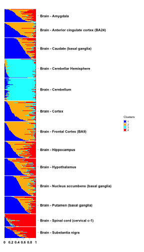

```{r knitr, echo=FALSE, results="hide"}
library("knitr")
library(kableExtra)
opts_chunk$set(tidy=FALSE,tidy.opts=list(width.cutoff=30),dev="png",fig.show="hide",
               fig.width=4,fig.height=7,
               message=FALSE, warning = FALSE)
```


```{r style, eval=TRUE, echo=FALSE, results='asis'}
BiocStyle::markdown()
```


# Introduction

In the context of RNA-seq expression (bulk or singlecell seq) data, the grade of membership model allows each sample (usually a tissue sample or a single cell) to have some proportion of its RNA-seq reads coming from each cluster. For typical bulk RNA-seq experiments this assumption
can be argued as follows: each tissue sample is a mixture of different cell types, and so clusters could represent cell types (which are determined by the expression patterns of the genes), and the membership of a sample in each cluster could represent the proportions of each cell type present in that sample.

Many software packages available for document clustering are applicable to modeling RNA-seq data. Here, we use the R package `r CRANpkg("maptpx")` [@Taddy2012] to fit these models, and add functionality for visualizing the results and annotating clusters by their most distinctive genes to help biological interpretation. We also provide additional functionality to correct for batch effects and also compare the outputs from two different grade of membership model fits to the same set of samples but different in terms of feature description or model assumptions.

---

# CountClust Installation

`r Biocpkg("CountClust")` requires the following CRAN-R packages: `r CRANpkg("maptpx")`, `r CRANpkg("ggplot2")`, `r CRANpkg("cowplot")`, `r CRANpkg("parallel")`, `r CRANpkg("reshape2")`, `r CRANpkg("RColorBrewer")`, `r CRANpkg("flexmix")`,`r CRANpkg("gtools")`, `r CRANpkg("devtools")` along with the Bioconductor package: `r Biocpkg("limma")`.

Before installing \Countclust{}, pelase install the latest version of the `r CRANpkg("maptpx")` package on Github. 

```{r install_github, eval=TRUE}
library(devtools)
install_github("TaddyLab/maptpx")
```

Then one can install the \CountClust{} package from Bioc as follows 

```{r install_countclust_bio, eval=FALSE}
source("http://bioconductor.org/biocLite.R")
biocLite("CountClust")
```

The development version of the `r Biocpkg("CountClust")` package is available on Github, along with some data packages used in examples for this vignette.

```{r install_countclust_github, eval=FALSE}
install_github('kkdey/CountClust')
```

Then load the package with:

```{r load_countclust, cache=FALSE, eval=TRUE,warning=FALSE}
library(CountClust)
```

---

# Data Preparation

We install data packages as `expressionSet` objects for bulk RNA-seq reads data from Brain tissue samples of human donors under GTEx (Genotype Tissue Expression) V6 Project (GTEx Consortium, 2013) [@GTEX2013 ]and a singlecell RNA-seq reads data across developmental stages in mouse embryo due to Deng *et al* 2014 [@Deng2014].

`Deng et al 2014` `r Rpackage("singleCellRNASeqMouseDeng2014")` data package is a processed version of the data publicly available at Gene Expression Omnibus (GEO:GSE45719)[http://www.ncbi.nlm.nih.gov/geo/query/acc.cgi?acc=GSE45719].

<!-- The data package due to Deng *et al* is a processed version of the data publicly available at Gene Expression Omnibus (GEO:GSE45719)[http://www.ncbi.nlm.nih.gov/geo/query/acc.cgi?acc=GSE45719]. 

The data package for GTEx V6 Brain sample data is again a processed version of the data publicly available at the [GTEx Portal](http://www.gtexportal.org/home/) (dbGaP accession phs000424.v6.p1, release date: Oct 19, 2015).
-->


```{r data_install_deng, eval=TRUE}
library(devtools)

read.data1 = function() {
x = tempfile()
download.file(
'https://cdn.rawgit.com/kkdey/singleCellRNASeqMouseDeng2014/master/data/Deng2014MouseEsc.rda',
destfile=x, quiet=TRUE)
z = get(load((x)))
return(z)
}

Deng2014MouseESC <- read.data1()
## Alternatively,
# install_github('kkdey/singleCellRNASeqMouseDeng2014')
```

`GTExV6Brain` The data package for GTEx V6 Brain sample data is also a processed version of the data publicly available at the [GTEx Portal](http://www.gtexportal.org/home/) (dbGaP accession phs000424.v6.p1, release date: Oct 19, 2015).

```{r data_install_gtex, eval=TRUE}
read.data2 = function() {
x = tempfile()
download.file(
'https://cdn.rawgit.com/kkdey/GTExV6Brain/master/data/GTExV6Brain.rda',
destfile = x, quiet=TRUE)
z = get(load((x)))
return(z)
}

GTExV6Brain <- read.data2()
## Alternatively
# install_github('kkdey/GTExV6Brain')
```

## Deng et al 2014

Load the scRNA-seq data due to Deng *et al* 2014.

```{r data_load_deng, eval=TRUE}
deng.counts <- Biobase::exprs(Deng2014MouseESC)
deng.meta_data <- Biobase::pData(Deng2014MouseESC)
deng.gene_names <- rownames(deng.counts)
```

## GTEx V6 Brain

Load the bulk-RNA seq data from GTEx V6 brain data.

```{r data_load_gtex, eval=TRUE}
gtex.counts <- Biobase::exprs(GTExV6Brain)
gtex.meta_data <- Biobase::pData(GTExV6Brain)
gtex.gene_names <- rownames(gtex.counts)
```

---

# Fitting the GoM Model

We use a wrapper function of the `topics()` function in the `r CRANpkg("maptpx")` due to Matt Taddy [@Taddy2012].

As an example, we fit the topic model for `k=4` on the GTEx V6 Brain data and save the GoM model output file to user-defined directory.

```{r topic_fit_gtex, eval=FALSE}
FitGoM(t(gtex.counts),
            K=4, tol=1,
            path_rda="../data/GTExV6Brain.FitGoM.rda")
```

Applying the same functionality for K=6 for the Deng et al single cell data.

```{r topic_fit_deng, eval=FALSE}
FitGoM(t(deng.counts),
            K=6, tol=0.1,
            path_rda="../data/MouseDeng2014.FitGoM.rda")
```

---

# Structure plot visualization

We have saved the results from the above clustering model fit on the GTEx Brain (dor K = 4) and the Deng et al data (for K=3,6). We perform the visualization for `k=6` for the Deng *et al* 2014 data.

```{r prepare_deng_gom,eval=TRUE, warning=FALSE}
data("MouseDeng2014.FitGoM")
names(MouseDeng2014.FitGoM$clust_6)
omega <- MouseDeng2014.FitGoM$clust_6$omega
```

We prepare the annotations for the visualization.

```{r plot_topic_deng_annot, eval=TRUE, warning=FALSE}
annotation <- data.frame(
  sample_id = paste0("X", c(1:NROW(omega))),
  tissue_label = factor(rownames(omega),
                        levels = rev( c("zy", "early2cell",
                                        "mid2cell", "late2cell",
                                        "4cell", "8cell", "16cell",
                                        "earlyblast","midblast",
                                         "lateblast") ) ) )

rownames(omega) <- annotation$sample_id;
```

Now we perform the visualization.

```{r plot_topic_deng,eval=TRUE, warning=FALSE, fig.align = "center", fig.show="asis", dpi=144, fig.width=3, fig.height=7}
StructureGGplot(omega = omega,
                annotation = annotation,
                palette = RColorBrewer::brewer.pal(8, "Accent"),
                yaxis_label = "Development Phase",
                order_sample = TRUE,
                axis_tick = list(axis_ticks_length = .1,
                                 axis_ticks_lwd_y = .1,
                                 axis_ticks_lwd_x = .1,
                                 axis_label_size = 7,
                                 axis_label_face = "bold"))
```

In the above plot, the samples in each batch have been sorted by the proportional memebership of the most representative cluster in that batch. One can also use `order_sample=FALSE` for the un-ordered version, which retains the order as in the data (see Supplementary analysis for example).

PCA and t-SNE are commonly used approaches to visualizing data in single cell and bulk RNA-seq experiments, we have aggregated CountClust grades of membership clustering with the PCA and/or t-SNE plots.

PCA  + CountClust coloring for Deng et al data : 

Plot PC1 and PC2 and color each point as a pie chart with CountClust grades of membership colors. 


```{r plot_topic_pie_tsne,eval=TRUE, warning=FALSE, fig.align = "center", fig.show="asis", dpi=144, fig.width=6, fig.height=4}
StructurePie(t(deng.counts), input_type="apply_tsne",
             use_voom=FALSE, omega = omega, xlab="TSNE1",
             ylab = "TSNE2", main = "STRUCTURE K=6 pie on tSNE")
```

T-SNE + CountClust coloring for Deng et al data :

Plot the first two co-ordinates of t-SNE and each point is colored as a pie chart witj CountClust grades of membership colors.

```{r plot_topic_pie_pca,eval=TRUE, warning=FALSE, fig.align = "center", fig.show="asis", dpi=144, fig.width=6, fig.height=4}
StructurePie(t(deng.counts), input_type="apply_pca",
           use_voom = TRUE, omega = omega, xlab="PCA1",
           ylab = "PCA2", main = "STRUCTURE K=6 pie on PCA")
```

The `use_coom` option is used to specify whether to perform the log CPM normalization on the counts data before applying the PCA or t-SNE.


Now we perform the Structure plot visualization for `k=4` for GTEx V6 data for Brain samples .

We load the GoM fit for `k=4`.

```{r prepare_gtex_gom, eval=TRUE}
data("GTExV6Brain.FitGoM")
omega <- GTExV6Brain.FitGoM$omega;
dim(omega)
colnames(omega) <- c(1:NCOL(omega))
```

We now prepare the annotations for visualization GTEx brain tissue results.

```{r annot_gtex, eval=FALSE}
tissue_labels <- gtex.meta_data[,3];

annotation <- data.frame(
    sample_id = paste0("X", 1:length(tissue_labels)),
    tissue_label = factor(tissue_labels,
                          levels = rev(unique(tissue_labels) ) ) );

cols <- c("blue", "darkgoldenrod1", "cyan", "red")
```

Now we perform the visualization.

```{r plot_topic_gtex, eval=FALSE, warning=FALSE, fig.align="center", fig.show="asis", dpi=144, fig.width=5, fig.height=7, out.width="5in", out.height="7in"}
StructureGGplot(omega = omega,
                annotation= annotation,
                palette = cols,
                yaxis_label = "",
                order_sample = TRUE,
                split_line = list(split_lwd = .4,
                                  split_col = "white"),
                axis_tick = list(axis_ticks_length = .1,
                                 axis_ticks_lwd_y = .1,
                                 axis_ticks_lwd_x = .1,
                                 axis_label_size = 7,
                                 axis_label_face = "bold"))
```



---

# Cluster Annotations

We extract the top genes driving each cluster using the `ExtractTopFeatures` functionality of the `r Biocpkg("CountClust")` package. We first perform the cluster annotations from the GoM model fit with $k=6` on the single cell RNA-seq data due to Deng *et al*.

```{r extract_features_deng, eval=TRUE, warning=FALSE}
data("MouseDeng2014.FitGoM")
theta_mat <- MouseDeng2014.FitGoM$clust_6$theta;
top_features <- ExtractTopFeatures(theta_mat, top_features=100,
                                   method="poisson", options="min");
gene_list <- do.call(rbind, lapply(1:dim(top_features$indices)[1],
                        function(x) deng.gene_names[top_features$indices[x,]]))
```

We tabulate the top $5$ genes for these $6$ clusters.

```{r top_genes_clusters_deng, eval=TRUE, fig.width=7} 
tmp <- do.call(rbind, lapply(1:5, function(i) toString(gene_list[,i])))
rownames(tmp) <- paste("Cluster", c(1:5))
tmp %>%
  kable("html") %>%
  kable_styling()
```

We next perform the same for the topic model fit on the GTEx V6 Brain samples data with `k=4` clusters.

```{r extract_features_gtex, eval=TRUE, warning=FALSE}
data("GTExV6Brain.FitGoM")
theta_mat <- GTExV6Brain.FitGoM$theta;
top_features <- ExtractTopFeatures(theta_mat, top_features=100,
                                   method="poisson", options="min");
gene_list <- do.call(rbind, lapply(1:dim(top_features$indices)[1],
                        function(x) gtex.gene_names[top_features$indices[x,]]))
```

The top $3$ genes (ensemble IDs) driving these $4$ clusters.

```{r top_genes_clusters_gtex, eval=TRUE}
tmp <- do.call(rbind, lapply(1:3, function(i) toString(gene_list[,i])))
rownames(tmp) <- paste("Cluster", c(1:3))
tmp %>%
  kable("html") %>%
  kable_styling()
```

---

# Supplementary analysis

As an additional analysis, we apply the `r Biocpkg("CountClust")` tools on another single-cell RNA-seq data from mouse spleen due to Jaitin *et al* 2014 [@Jaitin2014]. The data had technical effects in the form of `amplification batch` which the user may want to correct for.

We first install and load the data.

```{r data_install_jaitin, echo=TRUE, eval=TRUE}
read.data3 = function() {
x = tempfile()
download.file(
'https://cdn.rawgit.com/jhsiao999/singleCellRNASeqMouseJaitinSpleen/master/data/MouseJaitinSpleen.rda',
destfile = x, quiet=TRUE)
z = get(load((x)))
return(z)
}

MouseJaitinSpleen <- read.data3()
## Alternatively
# devtools::install_github('jhsiao999/singleCellRNASeqMouseJaitinSpleen')
```

```{r data_load_jaitin, echo=TRUE, eval=TRUE}
jaitin.counts <- Biobase::exprs(MouseJaitinSpleen)
jaitin.meta_data <- Biobase::pData(MouseJaitinSpleen)
jaitin.gene_names <- rownames(jaitin.counts)
```

Extracting the non-ERCC genes satisfying some quality measures.

```{r non_ercc, eval=TRUE, echo=TRUE}
ENSG_genes_index <- grep("ERCC", jaitin.gene_names, invert = TRUE)
jaitin.counts_ensg <- jaitin.counts[ENSG_genes_index, ]
filter_genes <- c("M34473","abParts","M13680","Tmsb4x",
                  "S100a4","B2m","Atpase6","Rpl23","Rps18",
                  "Rpl13","Rps19","H2-Ab1","Rplp1","Rpl4",
                  "Rps26","EF437368")
fcounts <- jaitin.counts_ensg[ -match(filter_genes, rownames(jaitin.counts_ensg)), ]
sample_counts <- colSums(fcounts)

filter_sample_index <- which(jaitin.meta_data$number_of_cells == 1 &
                              jaitin.meta_data$group_name == "CD11c+" &
                                 sample_counts > 600)
fcounts.filtered <- fcounts[,filter_sample_index];
```

We filter the metadata likewise.

```{r metadata, eval=TRUE, echo=TRUE}
jaitin.meta_data_filtered <- jaitin.meta_data[filter_sample_index, ]
```

We fit the GoM model for `k=7` and plot the Structure plot visualization to show that the amplification batch indeed drives the clustering patterns.

```{r topic_fit_jaitin, eval=FALSE, echo=TRUE}
StructureObj(t(fcounts),
            nclus_vec=7, tol=0.1,
             path_rda="../data/MouseJaitinSpleen.FitGoM.rda")
```

Load results of completed analysis.

```{r plot_topic_annot, eval=TRUE, echo=TRUE}
data("MouseJaitinSpleen.FitGoM")
names(MouseJaitinSpleen.FitGoM$clust_7)
omega <- MouseJaitinSpleen.FitGoM$clust_7$omega

amp_batch <- as.numeric(jaitin.meta_data_filtered[ , "amplification_batch"])
annotation <- data.frame(
    sample_id = paste0("X", c(1:NROW(omega)) ),
    tissue_label = factor(amp_batch,
                          levels = rev(sort(unique(amp_batch))) ) )
```

Visualize the sample expression profile.

```{r plot_topic, eval=TRUE, echo=TRUE, warning=FALSE, fig.align="center", fig.show="asis", dpi=144, fig.width=3, fig.height=7}
StructureGGplot(omega = omega,
                annotation = annotation,
                palette = RColorBrewer::brewer.pal(9, "Set1"),
                yaxis_label = "Amplification batch",
                order_sample = FALSE,
                axis_tick = list(axis_ticks_length = .1,
                                 axis_ticks_lwd_y = .1,
                                 axis_ticks_lwd_x = .1,
                                 axis_label_size = 7,
                                 axis_label_face = "bold"))
```

It seems from the above Structure plot that `amplification batch` drives the clusters. To remove the effect of amplification batch, one can use. For this, we use the `BatchCorrectedCounts()` functionality of the package.

```{r batch_correct, eval=FALSE, echo=TRUE}
batchcorrect.fcounts <- BatchCorrectedCounts(t(fcounts.filtered),
                                          amp_batch, use_parallel = FALSE);
dim(batchcorrect.fcounts)
```

---

# Acknowledgements

We would like to thank Deng *et al* and the GTEx Consortium for having making the data publicly available. We would like to thank Matt Taddy, Amos Tanay, Po Yuan Tung and Raman Shah for helpful discussions related to the project and the package.

---

# Session Info

```{r session_info, eval=TRUE}
sessionInfo()
```

---

# References


